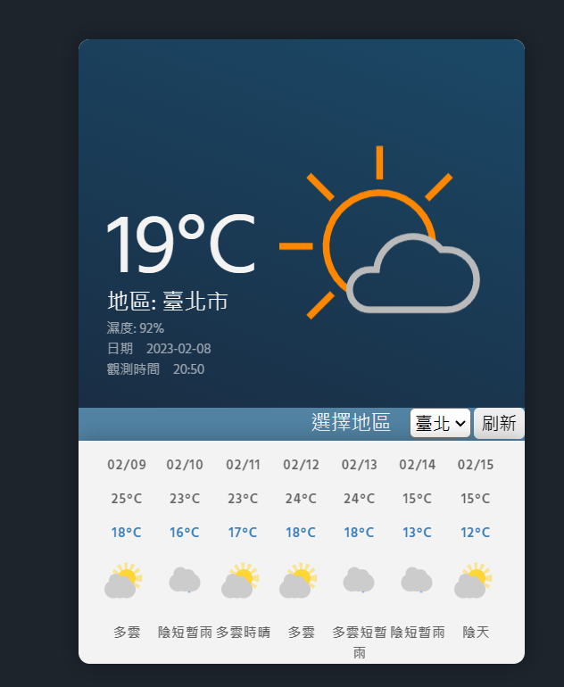
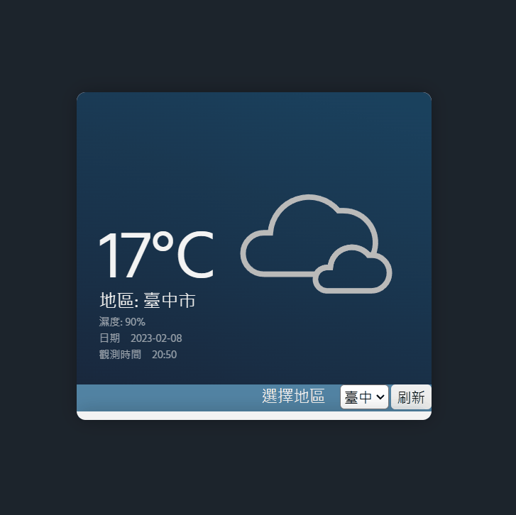

<a id="readme-topside"></a>

<h2 align="center">Weather-App-Taiwan(台灣地區天氣App)</h2>

<details>
  <summary>說明清單</summary>
  <ol>
    <li><a href="#project-link">專案連結</a></li>
    <li><a href="#使用展示">使用展示</a></li>
    <li><a href="#應用技術">應用技術</a></li>
    <li>
      <a href="#開始使用">開始使用</a>
      <ul>
        <li><a href="#先前準備">先前準備</a></li>
        <li><a href="#安裝">安裝</a></li>
        <li><a href="#使用">使用</a></li>
        <li><a href="#部署">部署</a></li>
      </ul>
    </li>
  </ol>
</details>

## <a id="project-link" href="https://cazanna-tolean.github.io/weather_app_TW/">專案連結</a>

點擊上方，查看效果。

## 使用展示





## 應用技術

- React
- Redux
- GitHub Actions Workflows

## 開始使用

### 先前準備

確認 node version >= 14.0

### 安裝

1. 複製此 repository

```sh
    git clone https://github.com/Cazanna-Tolean/weather_app_TW.git
```

2. 安裝 NPM 套件

```sh
    npm install
```

### 使用

- 開啟 repository

```sh
npm start
```

### 部署

- 藉由 gh-pages

```sh
npm run depoly
```
<p align="right">(<a href="#readme-topside">回到頂部</a>)</p>